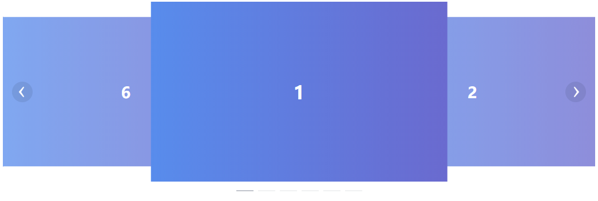

# vue-carousel-card

[](https://www.npmjs.com/package/vue-carousel-card)

> ❗ vue轮播卡片组件（vue carousel card component），```2.x```版本为```vue@3.x```组件  

> ❗ 如需在```vue@2.x```中使用，请使用 [](https://www.npmjs.com/package/vue-carousel-card/v/1.0.7)，Github v1.x地址 [](https://github.com/jekorx/vue-carousel-card/tree/1.x)  
> ```yarn add vue-carousel-card@^1.0.7```  
> ```npm i vue-carousel-card@^1.0.7 -S```  

### 示例

> [demo展示](https://jekorx.github.io/vue-carousel-card)  




### 用法

```bash
# 安装依赖
yarn add vue-carousel-card
# or
npm i vue-carousel-card -S
```

> 引入依赖，SPA，非SSR  

```javascript
// 样式需要单独引入
import { defineComponent } from 'vue'
import { CarouselCard, CarouselCardItem } from 'vue-carousel-card'
import 'vue-carousel-card/styles/index.css'

export default defineComponent({
  // 注册组件
  components: { CarouselCard, CarouselCardItem }
})

// 全局引入
import CarouselCard from 'vue-carousel-card'
import 'vue-carousel-card/styles/index.css'

const app = createApp(App)
app.use(CarouselCard)
app.mount('#app')
```

> 引入依赖，服务端渲染（SSR）中使用，以Nuxtjs为例  

```javascript
// TODO
// 后期测试后再进行补充
```

```html
<!-- 使用组件 -->
<template>
  <CarouselCard ref="carouselCardRef" :interval="7000" :autoplay="false" height="260px" type="card" arrow="always" @change="changeHandle">
    <CarouselCardItem v-for="i in 6" :key="i" :name="`cc_${i}`">
      <h1 v-text="i"></h1>
    </CarouselCardItem>
  </CarouselCard>
  <div style="text-align: center; padding: 10px">
    <button @click="prev">prev</button>
    <button @click="next">next</button>
    <button @click="setToFirst">set to first</button>
  </div>
  <CarouselCard :interval="3000" height="300px" :autoplay="false" arrow="always" direction="vertical">
    <CarouselCardItem v-for="i in 6" :key="i">
      <h1 v-text="i"></h1>
    </CarouselCardItem>
  </CarouselCard>
</template>
<script lang="ts">
import { defineComponent, ref } from 'vue'
import { ICarouselCard } from 'vue-carousel-card'

export default defineComponent({
  setup () {
    const carouselCardRef = ref<ICarouselCard>()
    const changeHandle = (index: number) => {
      console.log(index)
    }
    const next = () => {
      carouselCardRef.value?.next()
    }
    const prev = () => {
      carouselCardRef.value?.prev()
    }
    const setToFirst = () => {
      carouselCardRef.value?.setActiveItem(0)
    }
    return {
      carouselCardRef,
      changeHandle,
      next,
      prev,
      setToFirst
    }
  }
})
</script>
```

```css
/* 示例样式 */
h1 {
  height: 100%;
  padding: 0;
  margin: 0;
  display: flex;
  justify-content: center;
  align-items: center;
  color: #FFF;
  background: linear-gradient(90deg, rgba(88,140,236,1), rgba(106,106,207,1))
}
```

### 参数

##### CarouselCard Attributes

| 参数               | 说明                                 | 类型    | 可选值             | 默认值 |
| :----------------- | :---------------------------------- | :------ | :----------------- | :----- |
| height             | 走马灯的高度                         | string  | —                 | —     |
| initial-index      | 初始状态激活的幻灯片的索引，从 0 开始 | number  | —                 | 0      |
| trigger            | 指示器的触发方式                     | string  | click              | —     |
| autoplay           | 是否自动切换                         | boolean | —                 | true   |
| interval           | 自动切换的时间间隔，单位为毫秒       | number  | —                 | 3000   |
| indicator-position | 指示器的位置                         | string  | outside/none       | —     |
| arrow              | 切换箭头的显示时机                   | string  | always/hover/never | hover  |
| type               | 走马灯的类型                         | string  | card               | —     |
| loop               | 是否循环显示                         | boolean | -                  | true   |
| direction          | 展示的方向                           | boolean | horizontal/vertical | horizontal |
| pause-on-hover     | 鼠标悬浮时暂停自动切换               | boolean | -                  | true   |

##### CarouselCard Events

| 事件名称 | 说明             | 回调参数                              |
| :------- | :-------------- | :------------------------------------ |
| change   | 幻灯片切换时触发 | 目前激活的幻灯片的索引，原幻灯片的索引 |

##### CarouselCard Methods

| 方法名        | 说明               | 参数                                                                      |
| :------------ | :----------------- | :------------------------------------------------------------------------ |
| setActiveItem | 手动切换幻灯片     | 需要切换的幻灯片的索引，从 0 开始；或相应 carousel-card-item 的 name 属性值 |
| prev          | 切换至上一张幻灯片 | —                                                                        |
| next          | 切换至下一张幻灯片 | —                                                                        |

##### CarouselCardItem Attributes

| 参数  | 说明                                      | 类型   | 可选值 | 默认值 |
| :---- | :---------------------------------------- | :----- | :----- | :----- |
| name  | 幻灯片的名字，可用作 setActiveItem 的参数 | string | —     | —     |
| label | 该幻灯片所对应指示器的文本                | string | —     | —     |
